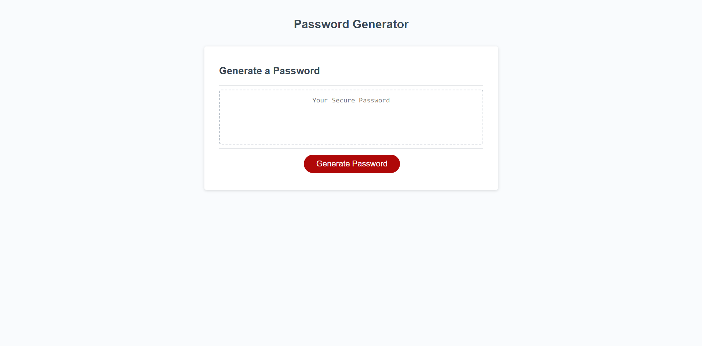
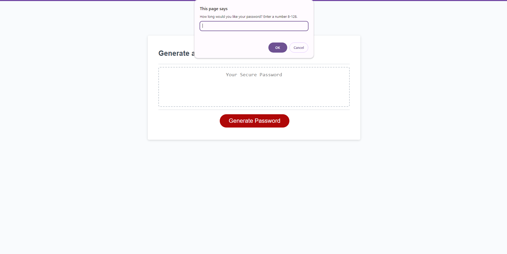
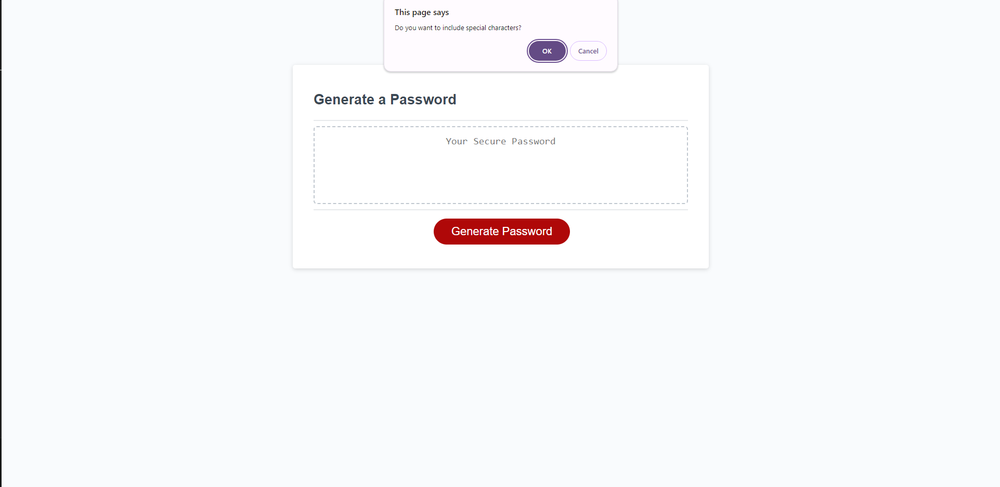
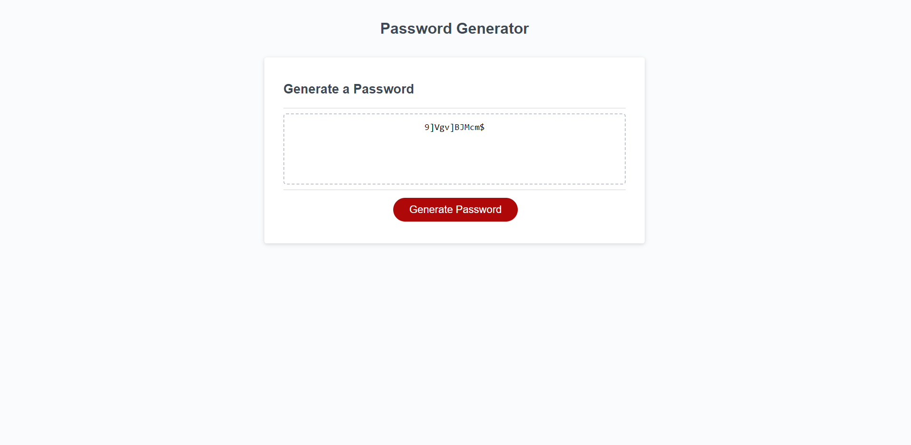
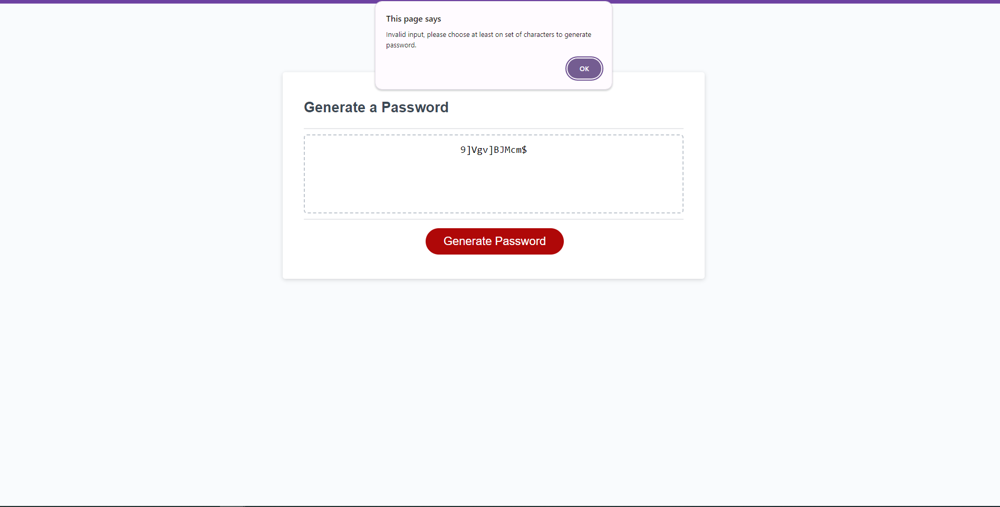

# <Password Generator>

## Description

If the user is struggling to come up with this password, they may come to this site to generate the password. They will be able to choose the length of their password from 8 to 128 characters, as well as choose if they want to include numbers, special characters, upper, and lower case letters. Once a series of choices have been made, after a few clicks a password will be generated.

## Usage

The User will load up the website, after that they will hit 'Generate Password' button. At that point the user will input a number between 8 and 128 for the length. If the user does not input a proper value then the prompt will show again until a correct input is entered. After that the User will have a series of four confirms asking the user if they would like to include numbers, special characters, upper, and lower case letters in their password. If the user does not choose to include any, an alert will tell the user that at least one arry needs to be choosen. If they user has selected at least one. Their password will be generated.

<!-- 

 -->

## License

N/A
